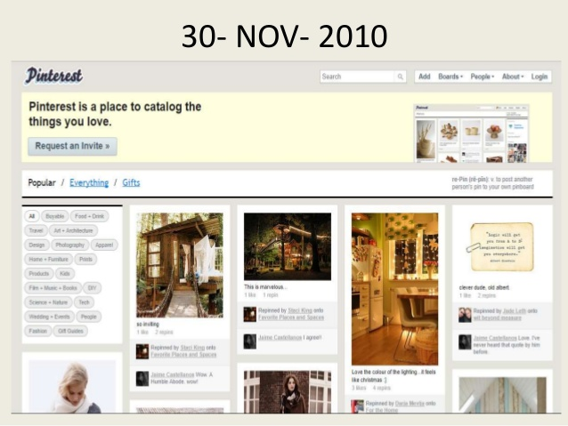

# Exercise #4: Mood Board
10 points
**DUE: Friday, April 19 by 5:00pm**
### Instructions

For this exercise, we'll put together all the techniques we covered this week to
make an interactive web page to build a collection of images related to a
theme—a [mood board](https://en.wikipedia.org/wiki/Mood_board).
Update `index.html` so that users start with an empty board and a prompt to 
enter a search query. Update `mood.js` to use an image search API to fetch 
images matching that  query and present them to the user. Let users select 
images from the result set to be placed on their board (by adding them to the 
DOM). Keep those images on the board and allow users to keep running searches 
and adding more images.
We'll use an image search API from
[Bing](https://docs.microsoft.com/en-us/bing/search-apis/bing-image-search/reference/endpoints).
I'll provide an API key over Slack that you can use by pasting it into
`apikey.example.js` and renaming the file `apikey.js`. You can then use the
BING_API_KEY variable in your javascript code. You'll notice that `apikey.js` is
in the `.gitignore` file; **please do not check the API key into GitHub**.
Even if it's not found by bots run by malicious users, it will likely be found by
Microsoft's own bots and deactivated, breaking your code and everyone else's.
Use your browser's developer tools to examine the response you get back from the
API and figure out which fields you want to use.
In your search results you'll also find a list of related search terms. Display
those to the user and make them clickable, such that clicking them runs a new
search with the suggested term as the query.
Don't worry about saving mood boards once they've been created. For this week we
will embrace ephemerality.
Remember to include in your submission any classmates you collaborated with and
any materials you consulted.
### Rubric
- Use `XMLHTTPRequest` to make an AJAX requests to the image search API (3 points)
    - Include the search term as a url query parameter
    - Include the correct API authorization header
    - Retrieve results in a json format
- Running a search clears previous search results (1 point)
- Use the DOM API to display image results to the user (2 points)
- Use the DOM API to display related concept results to the user (1 point)
- Clicking on a result image adds it to the user's mood board (2 points)
- Clicking on a related concept runs a new search for that concept (1 point)
