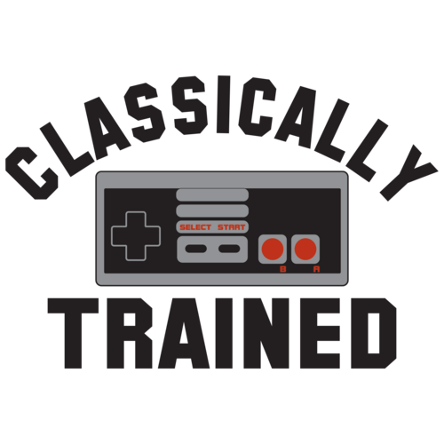

class: center, middle
# Web Development
## Winter 2026
MPCS 52553
---

## First Page  
## Introductions  
## HTML5  
## Tools  
## The DOM  
## CSS3  
## References
---

# Build a Web Page
Create a file called _yourname_.html:
```html
<html>
<head>
<title>Hello Class!</title>
</head>
<body>
<h1>Hello Class!</h1>
</body>
</html>
```
Double-click to open it with your browser.
---

# Build a Web Page
### Let's start a tiny web server

From the command line, in the directory where you saved your .html file, run:

`python3 -m http.server`

In your browser, navigate to localhost:8000/yourname.html
---

# Introductions    
---

## Trevor Austin (Lecturer)
trevoraustin@uchicago.edu

## Abhyas Mall (TA)
abhyas@uchicago.edu

---

# Important pages
- GitHub: https://github.com/UChicagoWebDev
- Slack: #web-development channel on https://cs-uchicago.slack.com/
- Canvas: https://canvas.uchicago.edu/courses/67482
---

# In-Class Exercise 1
Let's get started on Canvas: https://canvas.uchicago.edu/courses/67344/assignments/733746
---

# Objectives
- Web development is **consistently, rapidly changing**
- Things are (mostly) the way they are for a reason
---

# Objectives

---

# Policies and Grading
### Exercises
- Each week for the class (starting today!)
- Due each week before class
- Get harder over time and build on each other, so be sure to stay current

--

~~This class is all about writing software, and your grade will be based almost 
entirely on the software you write, instead of tests or quizzes. There is a mix 
of in-class exercises due at the end of the lecture (including one today!) and 
take-home exercises due each week right before class. You will create a fork of 
the course assignements repo on GitHub at https://classroom.github.com/classrooms/97002355-web-development-winter-2025 and push your submission there.~~

For ease of grading, please then submit the URL of your submission on Canvas.
Exercises are graded on a ten-point scale, according to the rubric at the
bottom of the exercise description. This course is a lot of work, but the scoring
is relatively generous. There is no curve, and no reason in principle everyone 
can't receive an excellent grade.
---

# Policies and Grading
Work handed in late without an extension will be accepted, but with a 1-point 
per day the assignment is late. Things happen, and sometimes you need an 
extension. Ask for one *before* the deadline. Extension requests made earlier or 
showing that you started work earlier will be considered more favorably. 

Do be careful not to be cavalier about due dates; there is another assignment 
every week and they generally increase in complexity, so it can be very hard 
to catch up if you fall too far behind. If you're struggling with the 
assignments please reach out right away on Slack or in office hours.
Extra credit way be awarded for in-class contributions, at the instructor's
discretion.
---

# Policies and Grading
### Collaboration
- Type your own code
- Include attribution for resources you use and people you collaborate with

--

In the real world, software development is a very collaborative process. And
because web development is especially fast-moving, a key objective of this
course if for students to learn how to learn new techniques by studying other
sites and consulting online resources. Accordingly, students are encouraged to
collaborate on assignments, and to use any resources they find helpful.
To do that in a way consistent with the University's academic honesty policy, we
have two simple rules:

1. Everyone turns in their own work on their own GitHub repo. Talk as much as 
you like, but literally type it out yourself. Don't copy and paste, you'll learn 
much less.
2. Include attribution for the people you worked with or the resources you 
consulted in your README for the assignment.
---

# Act Break
---

# Utopian Beginnings
The Web was initially proposed by Tim Berners-Lee in 1989, as a web for researchers at CERN to share ideas:
> We should work toward a universal linked information system, in which generality and portability are more important than fancy graphics techniques and complex extra facilities.
> 
> The aim would be to allow a place to be found for any information or reference which one felt was important, and a way of finding it afterwards. The result should be sufficiently attractive to use that it the information contained would grow past a critical threshold, so that the usefulness the scheme would in turn encourage its increased use.

https://www.w3.org/History/1989/proposal.html
---

# HTML5
---
# Intro to HTML5
- p, h1, h2, a, img, hr, ul, li, ol
- `display` property
- Tables: table, tr, th, td
- Validation
- Escape characters https://en.wikipedia.org/wiki/Character_encodings_in_HTML
---

# Tools
- Text Editor
- _View Source_
- Inspector / DevTools
---

# The DOM
---

# Document Object Model
- Tree of nodes/elements
- Parent nodes and child nodes
- Attributes
- Acts as the "API" into the document
- [CSS Playground](examples/week_1/cssplayground.html)
- https://en.wikipedia.org/wiki/Document_Object_Model
---

# Document Object Model
- Held locally in memory by the browser
- Editable by the user!
- https://twitter.com/POTUS/status/1407463658242908162
---

# Act Break
---

# CSS3
- Early history of CSS: https://www.w3.org/Style/LieBos2e/history/
- Styling independent of content: http://www.csszengarden.com/
---

# Intro to CSS3
- Selectors
  - https://developer.mozilla.org/en-US/docs/Web/CSS/CSS_Selectors
- Colors, borders, fonts, weights, alignment
- Box model: margins, padding, auto
  - [CSS Playground](cssplayground.html)
- Visibility
  - `display: block` and `display: none`
---

# Floats
- [CSS Playground](examples/week_1/cssplayground.html)
---

# References:
- [W3 Standards Consortium](https://www.w3.org/)
- [HTML Elements](https://developer.mozilla.org/en-US/docs/Web/HTML/Element)
- [Color Suggestions](https://flatuicolors.com/)
- [Photo Suggestions](https://unsplash.com/)
- [CSS Zen Garden](http://www.csszengarden.com/)
- [Browser Feature Availability](https://caniuse.com/)
---

# Take-Home Exercise 1: Resume Styling
- Assignment submissions are on [Canvas](https://canvas.uchicago.edu/courses/57047/assignments)
- Get the code to get started on [GitHub](https://classroom.github.com/a/-zZ8uRTP)
