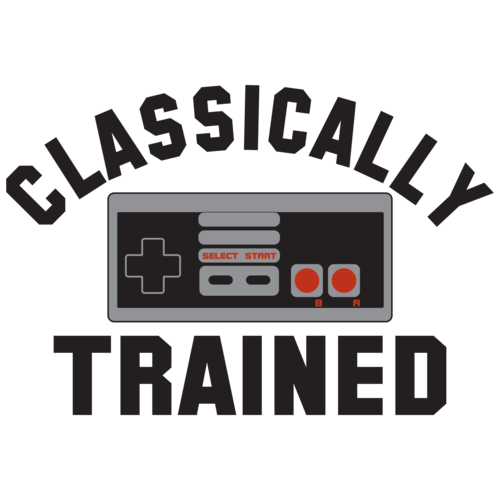

class: center, middle
# Web Development
## Autumn 2026
MPCS 52553
---

## First Page  
## Introductions  
## HTML5  
## Tools  
## The DOM  
## CSS3  
## References
---

# Build a Web Page
Create a file called _yourname_.html:
```html
<html>
<head>
<title>Hello Class!</title>
</head>
<body>
<h1>Hello Class!</h1>
</body>
</html>
```
Double-click to open it with your browser.
---

# Build a Web Page
### Let's start a tiny web server

From the command line, in the directory where you saved your .html file, run:

`python3 -m http.server`

In your browser, navigate to localhost:8000/yourname.html
---

# Introductions    
---

## Trevor Austin (Lecturer)
trevoraustin@uchicago.edu

## Zitong Li (TA)
lztong@uchicago.edu

---

# Important pages
- GitHub: https://github.com/UChicagoWebDev
- Slack: #web-development-autumn-2026 channel on https://cs-uchicago.slack.com/
- Canvas: https://canvas.uchicago.edu/courses/{{CANVAS_COURSE_ID}}/
---

# In-Class Exercise 1
Let's get started on Canvas: https://canvas.uchicago.edu/courses/{{CANVAS_COURSE_ID}}/assignments
---

# Objectives
- Web development is **consistently, rapidly changing**
- Things are (mostly) the way they are for a reason
- **new** Value over LLM Agents
---

# Objectives

---

# Policies and Grading
### Exercises
- Each week for the class (starting today!)
- Due each week before class
- Get harder over time and build on each other, so be sure to stay current

--

There is a mix of in-class exercises due at the end of the lecture (including
one today!) and take-home exercises due each week right before class. You all
have a GitLab repository for the course, created for you automatically at
https://gitlab.cs.uchicago.edu/courses/aut-26/mpcs52553.
For each exercise, you will create a new directory in your repository root
called exercise-1, exercise-2, etc. and add your submission there.

For ease of grading, please then submit the URL of your GitLab directory on Canvas.
If you forget to submit on Canvas, we will use the GitLab timestamp as the official
submission and not penalize you, but it may delay how quickly your work can be 
reviewed.
---

# Policies and Grading
### AI Usage
- AI use is **encouraged** for Labs and Exercises
- Make sure you understand the code you submit. Students will be expected to explain 
  their submissions in class discussions. If you cannot explain your code, you will 
  not receive credit for it.
- Lab 1 will ask you to create a CLAUDE.md file in your repository, which will 
  encourage Claude to help you learn, and not just do the work for you. You will be 
  asked to submit this file with your Lab 1 submission. After Lab 1, you are free to
  edit your CLAUDE.md file as you see fit, at your own risk.
---

# Policies and Grading
### Quizzes and Final Exam
- In-class, pen-and-paper
- No technology, including AI, allowed
- If you are going to miss class, please let the instructor know in advance. Quizzes
  missed during an excused absence will be rescheduled. Quizzes missed during an 
  unexcused absence will receive a 0.
---

# Policies and Grading
Work handed in late without an extension will be accepted, but with a 1-point 
per day the assignment is late. Things happen, and sometimes you need an 
extension. Ask for one *before* the deadline. Extension requests made earlier or 
showing that you started work earlier will be considered more favorably. Note 
that as described above, you may push your code to GitLab as you work, even 
past the deadline, without fear that incomplete work will be graded. If you 
push to GitLab on time but forget to submit on Canvas, we will use the GitLab
timestamp as the official submission and not penalize you.

Do be careful not to be cavalier about due dates; there is another assignment 
every week and they generally increase in complexity, so it can be very hard 
to catch up if you fall too far behind. If you're struggling with the 
assignments please reach out right away on Slack or in office hours.
Extra credit way be awarded for in-class contributions, at the instructor's
discretion.
---

# Policies and Grading
### Collaboration
- Type your own code
- Include attribution for resources you use and people you collaborate with

--

In the real world, software development is a very collaborative process. And
because web development is especially fast-moving, a key objective of this
course if for students to learn how to learn new techniques by studying other
sites and consulting online resources. Accordingly, students are encouraged to
collaborate on assignments, and to use any resources they find helpful.
To do that in a way consistent with the University's academic honesty policy, we
have two simple rules:

1. Everyone turns in their own work on their own GitLab repo. Talk as much as 
you like, but literally type it out yourself. Don't copy and paste, you'll learn 
much less.
2. Include attribution for the people you worked with or the resources you 
consulted in your README for the assignment.
---

# Act Break
---

# Utopian Beginnings
The Web was initially proposed by Tim Berners-Lee in 1989, as a web for researchers at CERN to share ideas:
> We should work toward a universal linked information system, in which generality and portability are more important than fancy graphics techniques and complex extra facilities.
> 
> The aim would be to allow a place to be found for any information or reference which one felt was important, and a way of finding it afterwards. The result should be sufficiently attractive to use that it the information contained would grow past a critical threshold, so that the usefulness the scheme would in turn encourage its increased use.

https://www.w3.org/History/1989/proposal.html
---

# HTML5
---
# Intro to HTML5
- p, h1, h2, a, img, hr, ul, li, ol
- `display` property
- Tables: table, tr, th, td
- Validation
- Escape characters https://en.wikipedia.org/wiki/Character_encodings_in_HTML
---

# Tools
- Text Editor
- _View Source_
- Inspector / DevTools
---

# The DOM
---

# Document Object Model
- Tree of nodes/elements
- Parent nodes and child nodes
- Attributes
- Acts as the "API" into the document
- [CSS Playground](examples/week_1/cssplayground.html)
- https://en.wikipedia.org/wiki/Document_Object_Model
---

# Document Object Model
- Held locally in memory by the browser
- Editable by the user!
- https://twitter.com/POTUS/status/1407463658242908162
---

# Act Break
---

# CSS3
- Early history of CSS: https://www.w3.org/Style/LieBos2e/history/
- Styling independent of content: http://www.csszengarden.com/
---

# Intro to CSS3
- Selectors
  - https://developer.mozilla.org/en-US/docs/Web/CSS/CSS_Selectors
- Colors, borders, fonts, weights, alignment
- Box model: margins, padding, auto
  - [CSS Playground](cssplayground.html)
- Visibility
  - `display: block` and `display: none`
---

# Floats
- [CSS Playground](examples/week_1/cssplayground.html)
---

# References:
- [W3 Standards Consortium](https://www.w3.org/)
- [HTML Elements](https://developer.mozilla.org/en-US/docs/Web/HTML/Element)
- [Color Suggestions](https://flatuicolors.com/)
- [Photo Suggestions](https://unsplash.com/)
- [CSS Zen Garden](http://www.csszengarden.com/)
- [Browser Feature Availability](https://caniuse.com/)
---

# Take-Home Exercise 1: Resume Styling
- Assignment submissions are on [Canvas](https://canvas.uchicago.edu/courses/75391/assignments)
- Get the code to get started on [GitHub](https://classroom.github.com/a/-zZ8uRTP)
