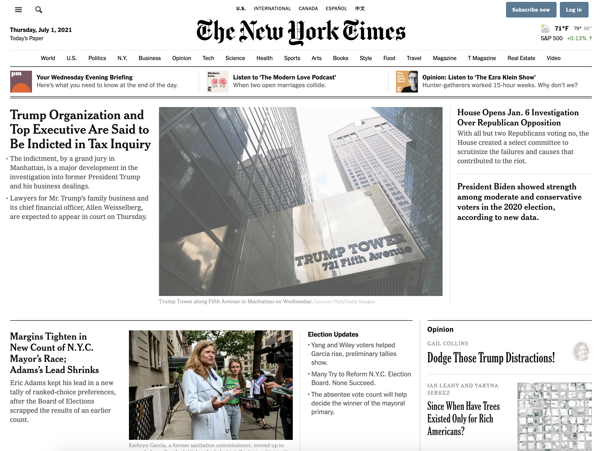
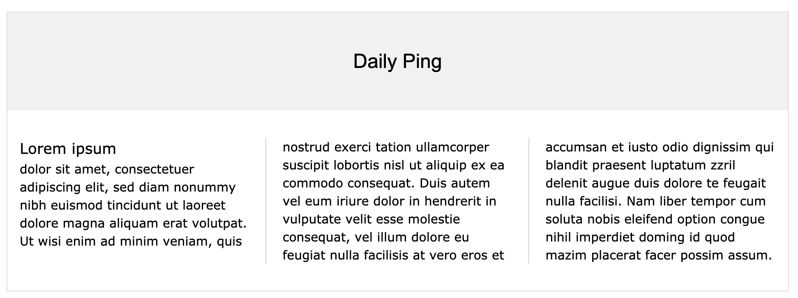
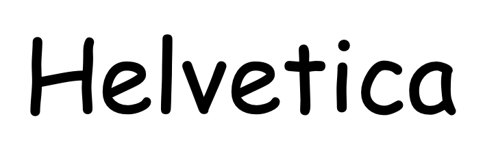

class: center, middle
# Web Development
## Week 2: Advanced Layout
---

class: agenda
# Advanced Styling
- selectors, icons, web fonts, CSS animation
# Modern Layouts
- css-column, flexbox, grid
- Lab: uchicago.edu layout
# Responsive Design
- media queries, mobile-first design
# Accessibility (a11y)
- screen readers, visual alerting, and captioning
# CSS Resets and Frameworks
- box-sizing, CSS resets, Bootstrap
---

# Advanced Styling: Selectors
https://developer.mozilla.org/en-US/docs/Web/CSS/CSS_selectors/Selectors_and_combinators
---

# Advanced Styling: Selectors
[CSS Diner](https://flukeout.github.io/)

---

# Act Break
---

# Modern Layouts
[The New York Times](https://nytimes.com)

???

The NYT home page has a very complicated layout that tries to capture the feel
of a physical newspaper. It has multiple sections laid out in vertical columns,
sometimes nested inside each other. In this section we'll cover three ways to
handle multi-column layout in order of increasing power and complexity.
---

# CSS Columns

[CSS Columns - Mozilla Documentation](https://developer.mozilla.org/en-US/docs/Web/CSS/CSS_Columns)
[Multi-Column Layout - W3Schools Guide](https://www.w3schools.com/css/css3_multiple_columns.asp)
---

# CSS Columns
The simplest layout method uses the `column-count` CSS attribute to spread
content over multiple columns. You can specify the spacing and borders between
column elements, and allow elements like headers to span multiple columns.
[/examples/week_2/columns.html](/examples/week_2/columns.html)
---

# CSS Columns - Masonry Layout
[When And How To Use CSS Multi-Column Layout - Smashing Magazine](https://www.smashingmagazine.com/2019/01/css-multiple-column-layout-multicol/#masonry-like-display-of-content)

---

# Flexbox
[CSS Flexbox - Mozilla Documentation](https://developer.mozilla.org/en-US/docs/Learn/CSS/CSS_layout/Flexbox)
[/examples/week_2/flex.html](/examples/week_2/flex.html)

---

# Act Break
---

# CSS Grid
[Basic Concepts of Grid Layout](https://developer.mozilla.org/en-US/docs/Web/CSS/CSS_Grid_Layout/Basic_Concepts_of_Grid_Layout)
[CSS Grid - Mozilla Documentation](https://developer.mozilla.org/en-US/docs/Web/CSS/CSS_Grid_Layout)
[/examples/week_2/grid.html](/examples/week_2/grid.html)

---

# Flexbox vs Grid
A simple question to ask yourself when deciding between grid or flexbox is:
- Do I only need to control the layout by row **or** column?
    ➡️ Use a flexbox
- Do I need to control the layout by row **and** column?
    ➡️ Use a grid

???

In addition to the one-dimensional versus two-dimensional distinction, there is another way to decide if you should use flexbox or grid for a layout. Flexbox works from the content out. An ideal use case for flexbox is when you have a set of items and want to space them out evenly in a container. You let the size of the content decide how much individual space each item takes up. If the items wrap onto a new line, they will work out their spacing based on their size and the available space on that line.
Grid works from the layout in. When you use CSS Grid Layout you create a layout and then you place items into it, or you allow the auto-placement rules to place the items into the grid cells according to that strict grid. It is possible to create tracks that respond to the size of the content, however, they will also change the entire track.
---

# Let's Examine: uchicago.edu Layout
[uchicago.edu](uchicago.edu)

???

The university's web page uses a multi-column layout in several places below the
large "hero element" at the top. Let's examine what tools the University uses to
achieve that layout.
---

# Advanced Styling: Icons

[/examples/week_2/icons.html](/examples/week_2/icons.html)
- [Web Icons Tutorial (W3Schools)](https://www.w3schools.com/icons/)
- [Font Awesome](https://fontawesome.com/)
- [Material Design (Google)](https://materializecss.com/icons.html)
- [Custom Icon Fonts (Fontello)](http://fontello.com/)
---

# Responsive Design
- [Media Queries (Mozilla Documentation)](https://developer.mozilla.org/en-US/docs/Web/CSS/Media_Queries/Using_media_queries)
- [Responsive Design (Mozilla Documentation)](https://developer.mozilla.org/en-US/docs/Learn/CSS/CSS_layout/Responsive_Design)
---

# Advanced Styling: Web Fonts

- [Web Fonts (Mozilla Documentation)](https://developer.mozilla.org/en-US/docs/Learn/CSS/Styling_text/Web_fonts)
- [Google Fonts](https://fonts.google.com/)
---

# Accessibility (a11y)
- [Accessibility (Mozilla Documentation)](https://developer.mozilla.org/en-US/docs/Web/Accessibility)
- [Handling Common Accessibility Problems (Mozilla Documentation)](https://developer.mozilla.org/en-US/docs/Learn/Tools_and_testing/Cross_browser_testing/Accessibility)
  - Screen reader compatibility
  - Keyboard UI controls
  - Color and contrast
  - Alt text captioning
---

# Advanced Styling: CSS Filters and Animation
- [Linear Gradient](https://developer.mozilla.org/en-US/docs/Web/CSS/linear-gradient)
- [Filters](https://developer.mozilla.org/en-US/docs/Web/CSS/filter)
- [Animation](https://developer.mozilla.org/en-US/docs/Web/CSS/CSS_Animations/Using_CSS_animations)
- [Parallax Scrolling](https://developers.google.com/web/updates/2016/12/performant-parallaxing)
.animate[

]
---

# CSS Resets and Frameworks
- `box-sizing` [(Mozilla Documentation)](https://developer.mozilla.org/en-US/docs/Web/CSS/box-sizing)
- [Eric Meyer's CSS Reset](https://meyerweb.com/eric/tools/css/reset/)
- [Normalize](https://github.com/necolas/normalize.css/)
- [Bootstrap](https://getbootstrap.com/)

???

The HTML and CSS specs have arisen out of competition between different browser
makers, who tried to drive both install base with users and adoption by
developers. There have been long periods where browsers did not have the same
behavior, and developers who wanted to present a consistent, attractive
experience to all users have had to adopt various tricks to get that
consistency.
---

# References
[CSS Layout: Evolution Detailed by Example (Medium.com)](https://medium.com/@rebeccapeltz/css-layout-evolution-detailed-by-example-579b31475392)
