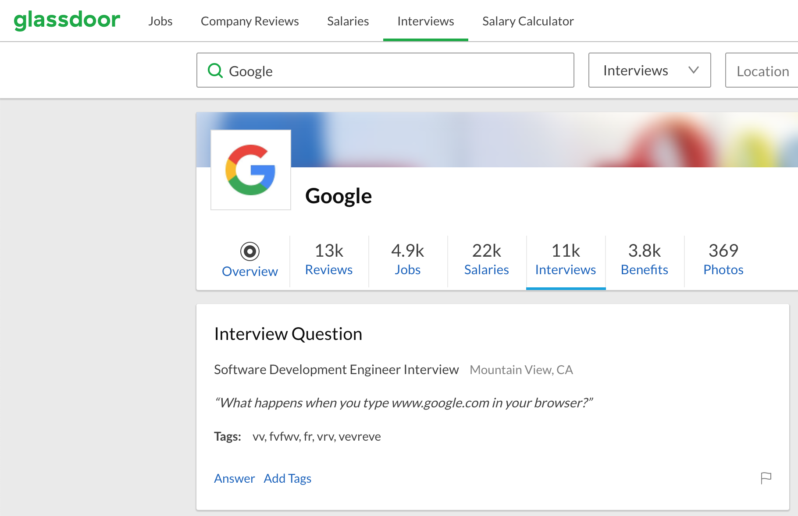
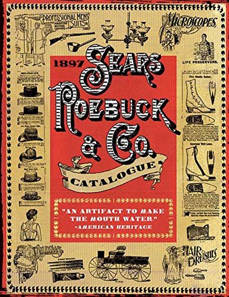

class: center, middle
# MPCS 52553: Web Development
## Week 3: Server-Side Rendering with ~~the LAMP Stack~~ 
## a LAMP-ish Stack
---

class: agenda
# HTTP
- CRUD operations, URL parameters, forms and validation
- The Network tab

# Sever-Side Rendering with the LAMP Stack
- PHP scripting, environment variables

# Databases
- SELECT and INSERT
- JOIN

# Lab Exercises
- HTTP Requests with `curl`
- Server-side rendering with PHP
- Exercise 3: A Weblog
---

class: fancyStrong
# HTTP

For a long time, a popular interview question at Google was "What happens when
you type google.com into your browser and hit enter?" I got it myself during
onsite interviews there in 2013.

Much of the answer is about .big[**HTTP**].



---

# HTTP
> The **Hypertext Transfer Protocol** (**HTTP**) is an application protocol for
distributed, collaborative, hypermedia information systems.[1] HTTP is the
foundation of data communication for the World Wide Web, where hypertext
documents include hyperlinks to other resources that the user can easily access,
for example by a mouse click or by tapping the screen in a web browser.
([Wikipedia](https://en.wikipedia.org/wiki/Hypertext_Transfer_Protocol))

[HTTP Overview (Mozilla Documentation)](https://developer.mozilla.org/en-US/docs/Web/HTTP/Overview)

[How Browsers Work](https://www.html5rocks.com/en/tutorials/internals/howbrowserswork/)
---

# HTTP: Requests

[HTTP Overview - Requests (Mozilla Documentation)](https://developer.mozilla.org/en-US/docs/Web/HTTP/Overview#requests)

[HTTP Request Methods (Mozilla Documentation)](https://developer.mozilla.org/en-US/docs/Web/HTTP/Methods)


---
# HTTP: Responses

[HTTP Overview - Responses (Mozilla Documentation)](https://developer.mozilla.org/en-US/docs/Web/HTTP/Overview#responses)

[HTTP Response Status Codes (Mozilla Documentation)](https://developer.mozilla.org/en-US/docs/Web/HTTP/Status)


---

# Let's Examine: HTTP Messsages

We can send and receive HTTP messages directly using the command line tool [cURL (Wikipedia)](https://en.wikipedia.org/wiki/CURL).

`curl -i http://uchicagowebdev.com`

`curl -i https://uchicagowebdev.com`
---

# Let's Examine: HTTP Messsages

```
HTTP/1.1 200 OK
Date: Fri, 11 Apr 2025 18:12:52 GMT
Server: Apache/2.4.58 () OpenSSL/1.0.2k-fips PHP/8.0.30
Upgrade: h2,h2c
Connection: Upgrade
Last-Modified: Fri, 04 Apr 2025 20:47:18 GMT
ETag: "332-631f9fdfb81ed"
Accept-Ranges: bytes
Content-Length: 818
Content-Type: text/html; charset=UTF-8

<html>
    <head>
        <title>Web Development</title>
        <style>
            body {width: 960px; margin: auto; padding-top: 2em;}
        </style>
    </head> 
    <body>
        <titlebar>
            <h1>Web Development</h1>
            <h3>MPCS 52553 - Winter Quarter 2025</h3>
        </titlebar>
        <main>
            <ul>
                <li><a href="syllabus.md">Syllabus</a></li>
                <li><a href="lecture_notes/">Lecture Notes</a></li>
                <li><a href="examples">Labs &amp; In-Class Examples</a></li>
                <li><a href="assignments">Weekly Programming Assignments</a></li>
                <li><a href="final_project">Final Project</a></li>
		        <li><a href="students">Student Pages</a></li>                
	        </ul>
        </main>
    </body>
</html>
```
---

# Lab 3-1: Writing HTTP Responses with Python

https://github.com/UChicagoWebDev/lab-3
---

# Web Servers: Apache
> The Apache HTTP Server ("httpd") was launched in 1995 and it has been the most
popular web server on the Internet since April 1996. It has celebrated its 20th
birthday as a project in February 2015. ([httpd.apache.org](https://httpd.apache.org/))


---

# Web Servers: Python Built-In

By default, when Apache receives an HTTP request, it looks for files on the local filesystem that match
the URL path and returns them to the web browser.

We can get a similar effect (though not intended for production) with Python's built-in http module:

`python3 -m http.server`
---

# Serving Static Files

---

# Serving Static Files
```
HTTP request comes in
Parse out the PATH
Does that path match a file on the local filesystem?
If yes, read that file and send its contents as the body of a new Response
If no, send a 404 Response
```


---

# Lab 3-2: Serving Static Files

https://github.com/UChicagoWebDev/lab-3
---

# Forms and Submissions

> Web forms are one of the main points of interaction between a user and a website or application. Forms allow users to enter data, which is generally sent to a web server for processing and storage or used on the client-side to immediately update the interface in some way (for example, add another item to a list, or show or hide a UI feature).
> 
> A web form's HTML is made up of one or more form controls (sometimes called widgets), plus some additional elements to help structure the overall form — they are often referred to as HTML forms. The controls can be single or multi-line text fields, dropdown boxes, buttons, checkboxes, or radio buttons, and are mostly created using the &lt;input&gt; element, although there are some other elements to learn about too.
> 
> Form controls can also be programmed to enforce specific formats or values to be entered (form validation), and paired with text labels that describe their purpose to both sighted and visually impaired users.

https://developer.mozilla.org/en-US/docs/Learn_web_development/Extensions/Forms/Your_first_form
---

# Lab 3-3: Receiving Form Data

https://github.com/UChicagoWebDev/lab-3
---

# Sanitizing User Input

We have to be careful with user input though! Try POSTing:

`<div style="position: absolute;top: 0;left: 0;width: 500;background-color: red;height: 1000;">Hahahaha!</div>`
---

# Sanitizing User Input
If we are going to include user input in our response, we have to make sure any 
HTML is escaped and can't be interpreted by the browser as HTML. 

https://github.com/UChicagoWebDev/lab-3
---

# Cookies

HTTP is **stateless**. The server does not keep track of a running conversation with the browser. Each request is treated as totally new, with no memory of any ones that came before it.


---

# Cookies

If we want to remember a user across multiple requests, we have to give them some small token that they can show to to the server on subsequent requests. Image a wristband or hand stamp at a concert or amusement park.

> A **cookie** (also known as a web cookie or browser cookie) is a small piece of data a server sends to a user's web browser. The browser may store cookies, create new cookies, modify existing ones, and send them back to the same server with later requests. Cookies enable web applications to store limited amounts of data and remember state information; by default the HTTP protocol is stateless.

https://developer.mozilla.org/en-US/docs/Web/HTTP/Guides/Cookies
---

# Lab 3-4: Cookies

https://github.com/UChicagoWebDev/lab-3
---

# Server-Side Rendering


Importantly, HTTP is the interface between the browser and the server. The 
browser sends its HTTP Requests out, then it gets HTTP Responses back. It has no
insight into how those responses are generated.

---
class: highlight-third-code-line

# Server-Side Rendering

That means that HTTP Responses don't have to just be the contents of pre-existing HTML files.
They can just be the output of an application.

```
HTTP request comes in
Parse out the path, headers, query variables, body, etc
**DO LITERALLY ANYTHING YOU CAN PROGRAM**
Send a new Response
```

Let's pause for a minute and think about the implications.
---

# Web Applications

What is the name of this big black building downtown?


---
class: split

# Web Applications

- 
- >By 1894, the Sears catalog had grown to 322 pages, including many new items, such as sewing machines, bicycles,      sporting goods and automobiles (later produced, from 1905 to 1915, by Lincoln Motor Car Works of Chicago [no relation to the current Ford line]).[20] By 1895, the company was producing a 532-page catalog. Sales were over $400,000 ($12 million in 2024 dollars) in 1893 and over $750,000 ($25 million in 2024 dollars) two years later.[21] By 1896, dolls, stoves, and groceries were added to the catalog.
  
Sears did not open a brick and mortar retail location until 1925.

https://en.wikipedia.org/wiki/Sears

---


# The LAMP Stack
One very popular thing you might want to do with your program that responds to
HTTP requests is have it interact with a database. And for a long time the most
popular such configuration of these pieces was the
[LAMP](https://en.wikipedia.org/wiki/LAMP_(software_bundle) stack.

---

# The LAMP Stack
> Originally popularized from the phrase "Linux, Apache, MySQL, and PHP", the acronym "LAMP" now refers to a generic software stack model. The modularity of a LAMP stack may vary, but this particular software combination has become popular because it is sufficient to host a wide variety of web site frameworks, such as WordPress. The components of the LAMP stack are present in the software repositories of most Linux distributions.

https://en.wikipedia.org/wiki/LAMP_(software_bundle)


---

# Databases

[MySQL (Wikipedia)](https://en.wikipedia.org/wiki/MySQL)

[Introduction to Relational Databases (MariaDB Documentation)](https://mariadb.com/kb/en/introduction-to-relational-databases/)

[A MariaDB Primer](https://mariadb.com/kb/en/a-mariadb-primer/)


---

# Databases: SQLite
[SQLite (Wikipedia)](https://en.wikipedia.org/wiki/SQLite)

`sqlite3`

`.databases`

`.open example_db`

`.tables`

`.schema example_table;`
---

# Databases: Select and Insert
`select * from posts;`

`select * from comments;`

```
insert into books (Title, SeriesID, AuthorID)
VALUES ("Lair of Bones", 2, 2);
```
---

# Databases: JOIN
[SQL Joins](https://www.w3schools.com/sql/sql_join.asp)
---

# Accessing the Database with Python
[Connecting to the Database](https://docs.python.org/3/library/sqlite3.html)
---

# Sanitizing Database Inputs

.credit[https://xkcd.com/327/]
---

# Sanitizing Database Inputs
[Using Placeholders to construct queries](https://docs.python.org/3/library/sqlite3.html#how-to-use-placeholders-to-bind-values-in-sql-queries)
```python
con = sqlite3.connect("db/my_db.sqlite3")
cur = con.cursor()
cur.execute("CREATE TABLE birthdays(name, year)")
data = {"name": "Alice", "year": 1865}
cur.execute("INSERT INTO birthdays_table VALUES(:name, :year)", data)
```
---

# Let's Examine: DIY SQL Injection
```
cd examples/week_3
python3 insert.py list
```
--
Imagine that we have a student, SBF, who got an F. What happens if he enters his name as:
`SBF','A');--`
---

# Lab 3-5: POSTing to the Wall

https://github.com/UChicagoWebDev/lab-3
---

# Exercise 3: A Web Journal

https://github.com/UChicagoWebDev/exercise-3