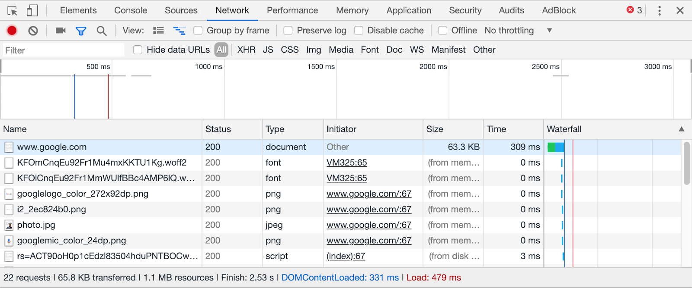
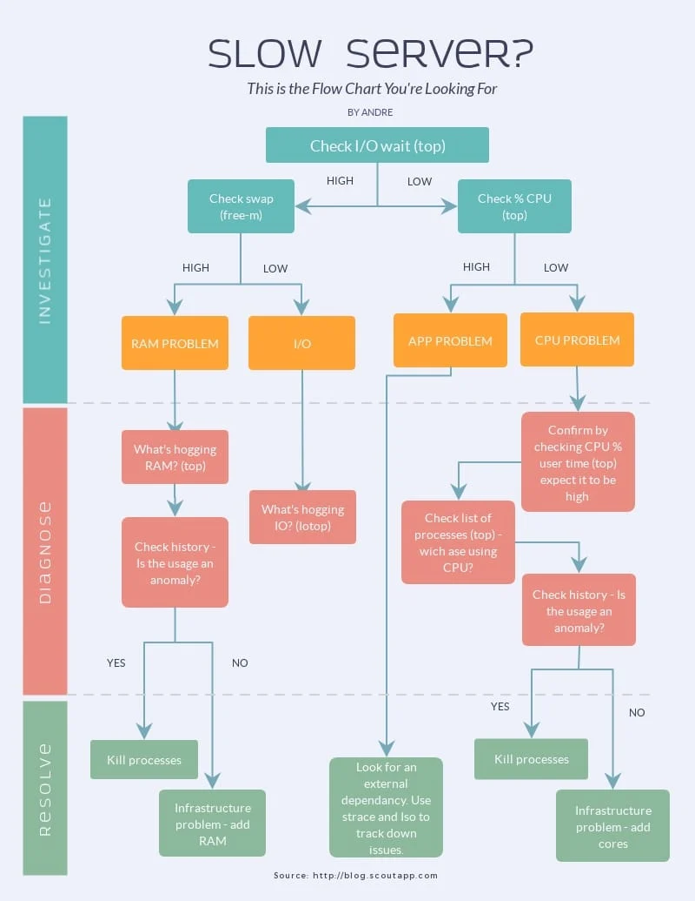
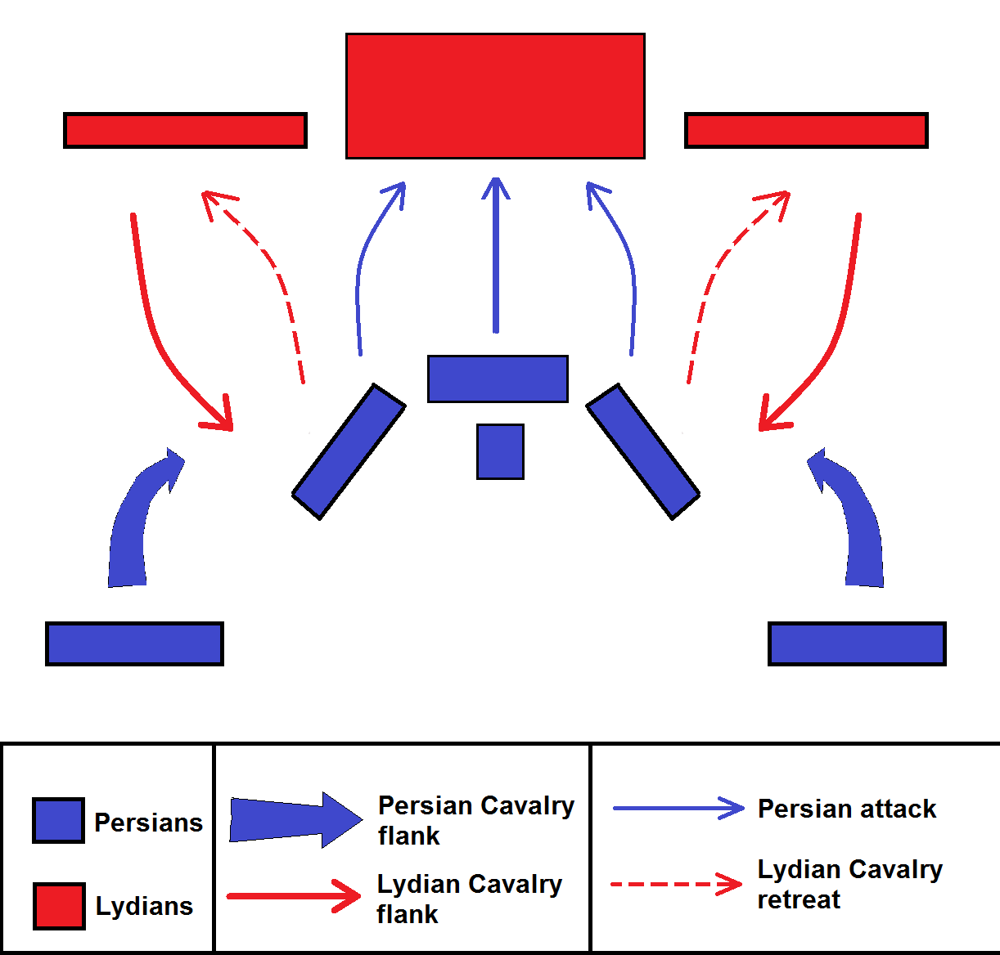
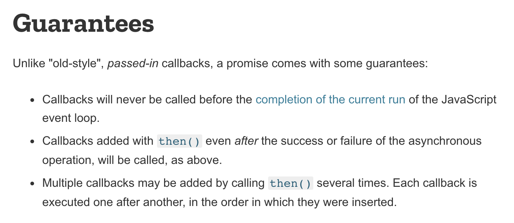

class: center, middle
# MPCS 52553: Web Development
## Week 5: Async and APIs
---

class: agenda
# Asynchronous Javascript
- setTimeout
- The Javascript Event Loop
- Promises
- `fetch`
- `async` and `await`

# Python and Flask
- Choosing Frameworks

# Labs
- SetTimeout: Egg Timer
- Fetch and Promises: Random Concept Walk
- APIs and Flask: Row Row Row Your Boat API
---

# Asynchronous Javascript


???

Show of hands, who here has written asynchronous or concurrent code before? You
might have used threads in C, or a library with “Worker” or “Executor” in the
name.

OK, some of you. Was that easy? Nod your head for yes, concurrency is easy,
shake your head for no, concurrency is hard. Right, it’s hard. There’s a reason
concurrency is always taught in the last lecture or two of your programming
classes.
---

# Synchronous Javascript
Remember, the first version of Javascript was written by one person in 10 days
in 1995.

In that conext, it makes sense that Javascript is **single-threaded**:
- Straightforward, simple.
- Doesn’t demand browsers or client machines support multi-threading.
---

# When is Synchronous Too Slow?


- Very large computation
- Manipulating a large or deeply-nested DOM tree
- Any HTTP request
---

# When is Synchronous Too Slow: HTTP


As we saw last week, sending an HTTP request and getting a response is almost 
always too slow.

Being single-threaded means that a function like `sleep()` would pause all 
execution, and any javascript in the UI would not respond to user input until 
the sleep was over.
---

# setTimeout
The simplest way to make javascript asynchronous is with [setTimeout](https://developer.mozilla.org/en-US/docs/Web/API/WindowOrWorkerGlobalScope/setTimeout
).
Its semantics are "wait this long *in the background*, then run this function."

```javascript
let myGreeting = setTimeout(function () {
  console.log("Hello!");
}, 2000);
console.log("Howdy!");
```

Output:
```console
Howdy!
Hello!
```
---

# Lab: Egg Timer
Make a page with a text entry field and a button called 'Set Timer'. When a user
puts a number in the field and clicks the button, wait that many seconds then
log "Ding!" to the console. Make sure you let users set multiple timers at once!
https://developer.mozilla.org/en-US/docs/Web/API/WindowOrWorkerGlobalScope/setTimeout
```javascript
let myGreeting = setTimeout(function () {
  console.log("Hello!");
}, 2000);
console.log("Howdy!");
```
---

# Wait But How
We just heard that javascript is single-threaded.
---

# The Javascript Event Loop


https://developer.mozilla.org/en-US/docs/Web/JavaScript/EventLoop

We don't have `sleep()`, but we can push the snooze button a **lot**. In a 
modern browser under no load, 200+ times a second. Recall that your eyes only 
work at 30-60 FPS.
---

# Lab: Sequential Asynchronous Functions
The time passed to setTimeout is a minimum, not a guarantee. What are some ways
we could can we make asynchronous calls happen in succession?
---

# Callback Heck
```javascript
let threeThings = setTimeout(function oneThing() {
  console.log(“one thing”);
  let thingTwo = setTimeout(function anotherThing() {
    console.log(“another thing”);
    let thingThree = setTimeout(function aThirdThing() {
      console.log(“a third thing”);
    }, 0)
  }, 0)
}, 0)
```
---

# Promises
https://developer.mozilla.org/en-US/docs/Web/JavaScript/Reference/Global_Objects/Promise


---

class: gallery
# Promises
https://developer.mozilla.org/en-US/docs/Web/JavaScript/Reference/Global_Objects/Promise


I wish they weren't called "Promises," which has misleading connotations. 

A better metaphor would be "Plans."




---

# Promises
https://developer.mozilla.org/en-US/docs/Web/JavaScript/Reference/Global_Objects/Promise

```javascript
new Promise((resolve, reject) => {
  console.log("one thing");
  resolve();
})
  .then(() => {
    console.log("another thing");
  })
  .then(() => {
    console.log("a third thing");
  });
```

The nice thing `then()` does is it also returns a Promise. That lets you chain
successive calls together.

Now there's a correspondence between how the code reads on the page and how it's
executed by the interpreter. That makes it a lot more readable and maintainable.
Remember that your primary audience when you write software is for other humans
to read, more than for a machine to execute.
---

# Promises
When a handler function returns a value, it is passed as an argument to the next
handler(s) in a chain:
```javascript
let addOne = (x) => {
  return x + 1;
};
Promise.resolve(0)
  .then((x) => addOne(x))
  .then((x) => addOne(x))
  .then((x) => addOne(x))
  .then((x) => {
    console.log(x);
  });
// 3
```
---

# An Example Promise
```javascript
function myAsyncFunction(url) {
  return new Promise((resolve, reject) => {
    const xhr = new XMLHttpRequest();
    xhr.open("GET", url);
    xhr.onload = () => resolve(xhr.responseText);
    xhr.onerror = () => reject(xhr.statusText);
    xhr.send();
  });
}
```

You pass executor two functions, **resolve** and **reject**.

Resolve is your success handler, and its return value is passed to any following `then` block.
Reject is your failure handler, and its return value is passed to any following `catch` block.
---

# Promise Guarantees
https://developer.mozilla.org/en-US/docs/Web/JavaScript/Guide/Using_promises#Guarantees


???

Unlike "old-style" _passed-in_ callbacks, a promise comes with some guarantees:
- Callbacks will never be called before the completion of the current run of the Javascript event loop.
  Callbacks added with `then()` even after the success or failure of the asynchronous operation, will be called, as above.
- Multiple callbacks may be added by calling `then()` several times. Each callback is executed one after the another, in the order in which they were inserted.
---


# Promise Guarantees
You can think of Promises as separate orders getting filled on the side.
You can always add a slice of pie to your order, whether or not they have
cooked your entree yet.
---

# Promise Failure
```javascript
doSomething()
  .then(function (result) {
    return doSomethingElse(result);
  })
  .then(function (newResult) {
    return doThirdThing(newResult);
  })
  .then(function (finalResult) {
    console.log("Got the final result: " + finalResult);
  })
  .catch(failureCallback);
```

--

Another nice thing they do is return errors if they’re passed one.
So errors propagate down the chain the way they would down the stack and you can
handle them once at the end.

Here if any one of the functions fails you will hit the failureCallback.
---

# When do we get our value back out of the promise?
```
x = new Promise(...)
(???)
return x+2;
```
--


---

class: gallery-big
# Promises are a one-way ticket

Like going to the underworld or the Phantom Zone


---

# Lab: Random Concept Walk
Write a page with a text entry field and a search button. Run the query through
our related searches API. Pick a random response and run _that_ through
the API. Repeat three more times, for a related searches chain that's five items
long, including the original query. Log the results to the console.
Hint: You may want to use javascript's [Fetch](https://developer.mozilla.org/en-US/docs/Web/API/Fetch_API/Using_Fetch)
method, which sends AJAX requests and returns Promises natively.
```javascript
console.log(query);
let request = fetch(MS_API + "?instance=" + query)
request.then((result) => {
  // parsed = parse result json
  // q2 = pick a related search at random
  console.log(q2);
  return fetch(MS_API + "?instance=" + q2)
}).then((result)=>{
  ...
}).then ...
```
---

# Async and Await
Define a function with the `async` keyword:
- Always goes directly into the side execution queue
- It automatically wraps any return value in a Promise
- Can use the `await` keyword inside it
https://developer.mozilla.org/en-US/docs/Learn/JavaScript/Asynchronous/Promises#async_and_await
---

# Lab: Random Concept Walk with Async
examples/week_5/randomwalk.html
---

# Python and Flask
**[Editorial]** We're now more than halfway through the course, and going to start to
depart from pure standards or tools chosen for their historical importance.
There are any number of perfectly fine server-side languages you could use, each
with fierce partisans. And because HTTP is a well-defined spec, all of them can
do a totally capable job of running web servers. We've already used PHP, and
talked about how early web servers were mostly written in C and Java. There are
popular web frameworks written in Ruby (Rails, Sinatra), Python (Django, Flask),
and even Javascript itself (Node). There are web frameworks for newer languages
like Go (Gorilla, Gin) or Rust (Actix, Iron), and a friend even made a popular
[web framework for Fortran](https://fortran.io/).

Arguments about what's the "best" language and framework are contentious because
of the same kinds of positive feedback loops we've discussed around browsers
and the HTML spec. How _valuable_ my skills and experience with a given language
or framework are is partly a function of how _popular_ those choices are with
other developers. That makes discussions frequently generate more light than
heat. The truth is there are lots of perfectly good ways to write a web
application, and we should hold our choices somewhat lightly.
---

# Python and Flask
That said, sometimes you do have to just pick something.
https://www.python.org/
https://palletsprojects.com/p/flask/
We're going to adopt Python for the remainder of the course because it's a very
popular web language that's _also_ used for lots of other general-purpose
programming tasks. If you're working on a web project with non-engineers who do
some coding, Python is most likely to be the language you both know.
Similarly, we're going to use Flask because it's widely used, and also
lightweight and relatively un-opinionated about how to structure web
applications.
---

# Lab: Row Row Row Your Boat API
If you already have an earlier version of Python you use for other projects, you
may want to install [pyenv](https://github.com/pyenv/pyenv) first.
Make a Flask app that returns the lyrics of a children's song.
As a stretch goal, add an endpoint that lets you add verses.
```python
from flask import Flask
app = Flask(__name__)
@app.route('/')
def hello_world():
    return 'Hello, World!'
```
---

# This is as far as we got on Week 5 – pushing the content below to Week6
---

# Cookies
One disadvantage of web browsers as an execution environment is security: users
are constantly downloading and executing arbitrary, untrusted Javascript code
from third parties. You don't really want to be storing passwords or API keys in
places where Javascript can get to them. But you often want _some_ kind of
persistence so the user doesn't get logged out if they refresh the page or close
the tab.
One way to do that is with
[Cookies](https://developer.mozilla.org/en-US/docs/Web/HTTP/Cookies),
small files the browser stores and can then include in subsequent HTTP requests.
By default, Cookies can be restricted to only get sent to the domain that
created them, and can be created with the
[HttpOnly flag](https://developer.mozilla.org/en-US/docs/Web/HTTP/Cookies#restrict_access_to_cookies)
to make them inaccessible with Javascript.
Here's a good example of reading and writing cookies with Flask:
https://stackoverflow.com/a/46664792
---

# Token-Based Authentication
Another thing that API designers will do, especially for APIs that won't just be
used in the browser, is to have the user enter their secure credentials once,
and then to give the user a **time-limited** access token. That can be used more
safely in Javascript code than a durable password or API key, because if an
attacker is somehow able to steal it, it's likely to already be expired. We call
these session tokens, because they're only intended to last the life of one user
session.
The API will then store those access tokens on the server and check whether
incoming requests (1) have a token (2) that the server knows about and (3) has
not yet expired.
## 
---

# Magic Links
Long, strong passwords can be clumsy to enter, especially on mobile devices
(which may be powered by the same API as the web app!).
Slack popularized an alternative: send the user a "magic link" that contains a
long, unique identifier that functions as a one-time password to log the user in.
That's no less secure than having a password reset link or form that sends a
message the same way, and considerably more convenient.
The server just needs to generate one-time passwords and save them, and then
have an API endpoint for users to make requests to. If they make one with a
one-time password that hasn't been used, it authorizes them (possibly setting a
cookie or sending a session token) and [redirects them](https://developer.mozilla.org/en-US/docs/Web/API/Window/location)
to the appropriate page.
https://www.waveguide.io/examples/entry/passwordless-login/
