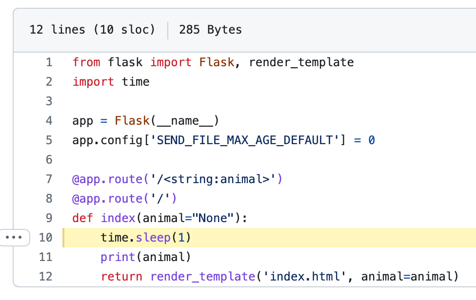

class: center, middle
# MPCS 52553: Web Development
## Week 6: Storage, Arguments, and Single Page Applications
---

class: agenda
# What is a Single Page Application (SPA)?
- Static assets in Flask
- Path, Routing and history
- Review: Query Variables
- Review: Fragments
- Cookies
- SessionStorage and LocalStorage
- Lab: Who is Best? A toy single-page application
---

# Watch Party 2: The Single Page Experience
Just as a preview, we're going to be using these techniques to make a new version of Watch Party that doesn't do any server-side rendering.

---

# Single Page Applications (SPAs)
> A single-page application (SPA) is a web application or website that interacts
> with the user by dynamically rewriting the current web page with new data from
> the web server, instead of the default method of a web browser loading entire
> new pages. The goal is faster transitions that make the website feel more like
> a native app.
>
> In a SPA, a page refresh never occurs; instead, all necessary HTML,
> JavaScript, and CSS code is either retrieved by the browser with a single page
> load,[1] or the appropriate resources are dynamically loaded and added to the
> page as necessary, usually in response to user actions.

https://en.wikipedia.org/wiki/Single-page_application

---
# Why Single-Page Applications?
- Faster response times
    - Even sometimes at the expense of initial load
- Avoids a page refresh that would interrrupt a long-running process, especially playing media
- Can be packaged and delivered via [CDN](https://developer.mozilla.org/en-US/docs/Glossary/CDN)

---
# Static Assets in Flask
Flask has built-in support for serving static assets, so we'll use that: https://flask.palletsprojects.com/en/2.0.x/tutorial/static/

### From Exercise 5:
- [create_room.html](https://github.com/UChicagoWebDev/exercise-5/blob/main/app.py#L78-L87)
- [script.js](https://github.com/UChicagoWebDev/exercise-5/blob/main/templates/index.html#L14)
- [tv.jpeg](https://github.com/UChicagoWebDev/exercise-5/blob/main/templates/index.html#L27)

We can send explicitly with https://flask.palletsprojects.com/en/2.2.x/api/#flask.Flask.send_static_file, or let Flask handle it by default by putting them in our `static/` directory.
---

# Path

Review: The `path` is the part of a url that comes after the domain. 
- By convention, it signals to the user where they are inside a web application and communicates things like heirarchical 
categories
- Servers, including Flask, are frequently structured around a big case statement keyed
off the path
- Changing the path means loading a new page

https://developer.mozilla.org/en-US/docs/Learn/Common_questions/Web_mechanics/What_is_a_URL#path_to_resource
---

# Path, Routing, and History
Look at our example application in `mpa`: 
[week_6/mpa](https://github.com/UChicagoWebDev/course_materials/tree/main/examples/week_6/mpa).

We have modified it to simulate it being slow to load:

from [app.py](https://github.com/UChicagoWebDev/course_materials/blob/main/examples/week_6/mpa/app.py#L10)

---

# Path, Routing, and History
`spa` only loads once, then switches between animals instantly with javascript.
But what if we want to be able to link to `/cat`? What if we want `/bear` in our
browser history?

By moving to a single-page setup, we have gained speed but lost some built-in browser behaviors.
Now, we need to use javascript APIs to fill back in what we lost.

Modify the example app in `spa/` so that the animal we pick as best goes into
our browser history. Make sure that if we load the page with that URL, the
correct animal is identified as best.
---

# Lab: Who is Best?

Modify the example app in `spa/` so that the animal we pick as best goes into
our browser history. Make sure that if we load the page with that URL, the
correct animal is identified as best.

To do this, we will use the https://developer.mozilla.org/en-US/docs/Web/API/History_API
---

# Review: Query Parameters

Review: query parameters are used by default by form submissions, in GET requests. 
- By convention, they are used to represent configuration options the user has sent, 
like a search query.
- For the purposes of the browser history, they work exactly the
same as the path: changing query parameters means loading a new page

https://developer.mozilla.org/en-US/docs/Learn/Common_questions/Web_mechanics/What_is_a_URL#parameters
---

# Review: Fragments

Review: fragments are used to make a table of contents. 
- On page loads and clicks, the browser will scroll to an element with an `id` equal to the fragment, if one exists
- They also trigger the `:target` pseudo-class
- Fragments go into the history, so the Back and Forward buttons will cause the page to scroll, but do not cause the page to reload

https://developer.mozilla.org/en-US/docs/Learn/Common_questions/Web_mechanics/What_is_a_URL#anchor
---

# Cookies

Review: A cookie is a small piece of information left on a visitor's computer by a website, via a web browser.
Cookies are used to personalize a user's web experience with a website. It may contain the user's preferences or inputs when accessing that website. A user can customize their web browser to accept, reject, or delete cookies.
Cookies can be set and modified at the server level using the Set-Cookie HTTP header, or with JavaScript using document.cookie.

https://developer.mozilla.org/en-US/docs/Glossary/Cookie
---

# SessionStorage and LocalStorage
`sessionStorage` maintains a separate storage area for each given origin that's available for the duration of the page session (as long as the browser is open, including page reloads and restores).
- Stores data only for a session, meaning that the data is stored until the browser (or tab) is closed.
- Data is never transferred to the server.
- Storage limit is larger than a cookie (at most 5MB).
`localStorage` does the same thing, but persists even when the browser is closed and reopened.
- Stores data with no expiration date, and gets cleared only through JavaScript, or clearing the Browser cache / Locally Stored Data.
- Storage limit is the maximum amongst the two.

https://developer.mozilla.org/en-US/docs/Web/API/Web_Storage_API
---

# Watch Party 2:
### The Single Page Experience
https://github.com/UChicagoWebDev/exercise-6