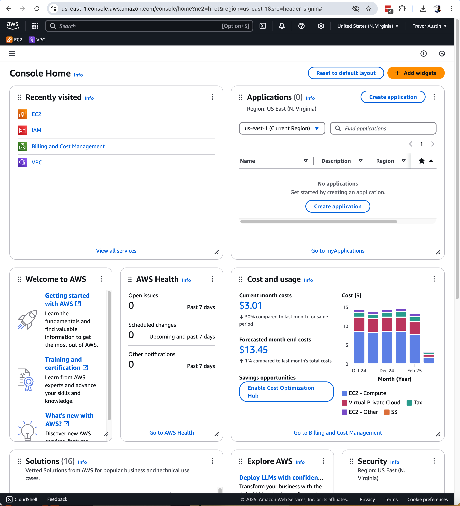
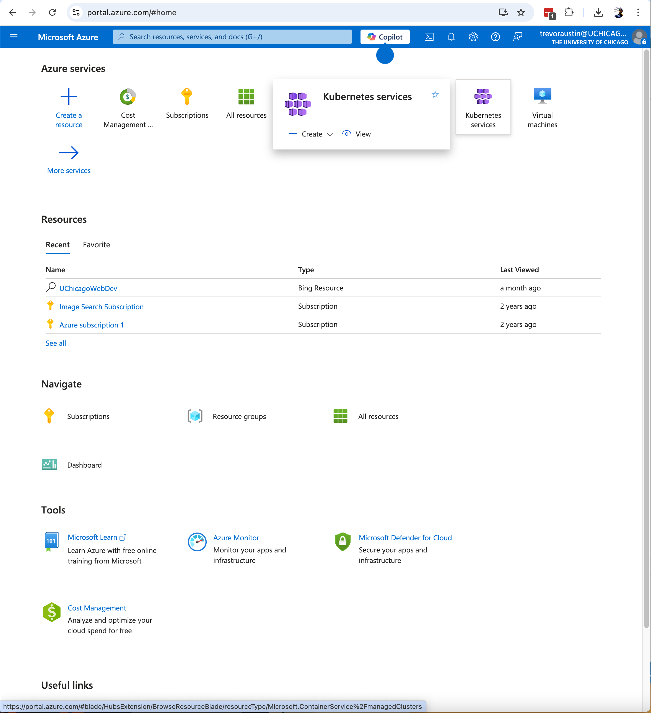

class: center, middle
# Web Development Winter 2022
## Week 9: Security, Testing, Production \[WIP\]
---

class: agenda
# Secure Logins
- Assume attackers will get your DB
- Storing secure hashes
- Lab: Securely storing passwords with bcrypt, salt, and pepper

# Automated Testing
- Time-consistency vs correctness
- `pytest`
- Lab: Add Tests to Passwords App

# Continuous Integration
- GitHub.com CI for passwords app

# Deployment to Cloud Hosting
- AWS Free Usage Tier
- Heroku Free Resources

# Stretch: Feature Flags
---
# Password Security
You should do your best to keep your database and its contents safe. But
experience teaches us that human organizations are imperfect at best at keeping
database contents secure. We need to plan to minimize damage in the not-all-that
unlikely event that someone is able to steal its contents.

---

# Password Security

## From [CSO Magazine](https://www.csoonline.com/article/2130877/the-biggest-data-breaches-of-the-21st-century.html)
---

# Password Security
Yours truly has been a victim as well. I still get identity monitoring from when
my forms were stolen in the OPM hack:
https://en.wikipedia.org/wiki/Office_of_Personnel_Management_data_breach
---

# Password Security
Databases of usernames and passwords are valuable because users re-use passwords
for multiple web services. They shouldn't, but they do. So even if your web
project doesn't have anything of value, a large enough list of usernames and
passwords will have some that also get an attacker access to users' bank
accounts, credit cards, or email addresses.
--
As developers we often won't have control over whether the database (or its
backups!) are stored securely, and it only takes one leak for the data to live
forever on the internet. There's no way to unring the bell. What we do have
control over though, is whether our databases store passwords at all in the
first place.
---

# Password Security: One-Way Hashing
The first thing you could do is, instead of storing passwords directly, you
could store a one-way hash. That lets you check whether the password a user
enters is the right one (just hash it and compare the hashes), and there's no
easy way to get the passwords from the hashes.
--

But just because there's no _easy_ way doesn't mean that there's no way. And
modern computers make lots of hard things possible!
--

You might try every possible password, or every likely one by using the words in
a dictionary. You might
[cleverly precompute](https://en.wikipedia.org/wiki/Rainbow_table) hashes in a
space-efficient format for re-use.
---

# Password Security: Bcrypt, Salt and Pepper
To protect against those attacks, we're going to do two things: we're going to
use a hashing function that's **expensive to compute**, so that
guessing passwords by brute force becomes prohibitively expensive, and we're
going to **salt** passwords with a random unique string, so attackers can't use
pre-computed lookup tables.

We'll also include a second kind of salting that's stored on the application
server and not on the database at all, so it's less likely to be stolen
alongside the database contents.

## https://cheatsheetseries.owasp.org/cheatsheets/Password_Storage_Cheat_Sheet.html
---

# Lab: Passwords
In the `/examples/week_9/passwords` directory we have a simple app that creates
user accounts with passwords and checks whether a login was successful. Right
now it is storing passwords in plaintext though. Modify it to:
- Store hashes created with `bcrypt`
- Store a unique salt for each row that's used to create the hash
- Incorporate a pepper stored in a config file
https://github.com/pyca/bcrypt/
---

class: bigquote
# Automated Testing

> &quot;If my code is wrong, won't my tests just be wrong in the same way?&quot;
---

# Automated Testing
You do get some amount of correctness validation by writing out your business
logic a second time. It can work like a form of
[Rubber Duck Debugging](https://en.wikipedia.org/wiki/Rubber_duck_debugging).
--

More importantly, we use tests for **time consistency**. They future developers,
including future us, make changes and additions to the code with **confidence
that they're not accidentally breaking something**.
---

# Automated Testing
## As a bonus, automated tests run much faster than conducting tests by hand.
---

# Automated Testing: `pytest`
There is a testing library called `unittest` built into the Python standard
library, but the most commonly used framework is an external library called
`pytest`
## https://docs.pytest.org/en/latest/
---

# Lab: Add Tests to Password App
## https://github.com/UChicagoWebDev/course_lectures/tree/master/examples/week_9/passwords_with_tests
---

# Continuous Integration
Once we have the computer running our tests for us, the next step is to have it
run the tests every time we make a change.
## https://en.wikipedia.org/wiki/Continuous_integration
---

# Continuous Integration
Current best practice is to have a cluster of computers automatically run all
the tests every time anyone on the team pushes a new commit to version control.
Several providers offer this as a service:
- https://github.com/features/actions
- https://circleci.com/
- https://travis-ci.com/
- https://docs.gitlab.com/ee/ci/

All of the above offer automated continuous integration for free some some
projects.
---

# Deployment to Cloud Hosting
Cloud hosting is an enormous business. In Q4 2022, Amazon Web Services was
responsible for nearly 200% of the company's profits. It made $5.2 billion,
while subsidizing the rest of the business to the tune of $2.4B.
> North America segment operating loss was $0.2 billion, compared with operating
> loss of $0.2 billion in fourth quarter 2021. International segment operating
> loss was $2.2 billion, compared with operating loss of $1.6 billion in fourth
> quarter 2021. AWS segment operating income was $5.2 billion, compared with
> operating income of $5.3 billion in fourth quarter 2021.

## https://ir.aboutamazon.com/news-release/news-release-details/2023/Amazon.com-Announces-Fourth-Quarter-Results/default.aspx
---

# Deployment to Cloud Hosting
Cloud hosting has those same self-reinforcing feedback loops we've talked about
in other parts of the course, so the big providers all offer free usage tiers to
attract developers to their platforms:
https://aws.amazon.com/free/
https://azure.microsoft.com/en-us/pricing/free-services/
https://cloud.google.com/free
---

# Deployment to Cloud Hosting
`deploy.sh`
---

# Deployment to Cloud Hosting

---

# Stretch: Feature Flags
https://martinfowler.com/articles/feature-toggles.html
Especially the Release Toggles section:
https://martinfowler.com/articles/feature-toggles.html#CategoriesOfToggles
https://en.wikipedia.org/wiki/Feature_toggle
https://launchdarkly.com/use-cases/
