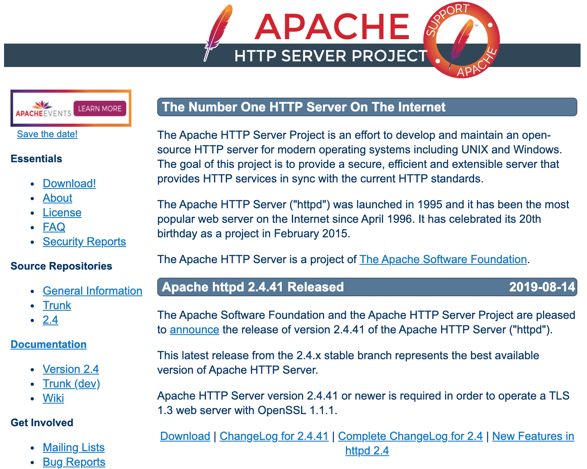
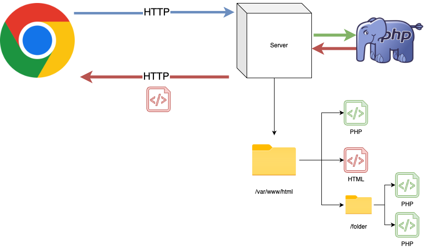

class: center, middle

# MPCS 52553: Web Development
## Week 3: Server-Side Rendering with the LAMP Stack
---

class: agenda

# HTTP
- CRUD operations, URL parameters, forms and validation
- The Network tab

# Sever-Side Rendering with the LAMP Stack
- PHP scripting, environment variables

# Databases
- SELECT and INSERT
- JOIN

# Lab Exercises
- HTTP Requests with `curl`
- Server-side rendering with PHP
- Exercise 3: A Weblog

---

# HTTP


???

For a long time, a popular interview question at Google was "What happens when
you type google.com into your browser and hit enter?" I got it myself during
onsite interviews there in 2013.

Much of the answer is about HTTP
---

# HTTP

> The **Hypertext Transfer Protocol** (**HTTP**) is an application protocol for
distributed, collaborative, hypermedia information systems.[1] HTTP is the
foundation of data communication for the World Wide Web, where hypertext
documents include hyperlinks to other resources that the user can easily access,
for example by a mouse click or by tapping the screen in a web browser.
([Wikipedia](https://en.wikipedia.org/wiki/Hypertext_Transfer_Protocol))

[HTTP Overview (Mozilla Documentation)](https://developer.mozilla.org/en-US/docs/Web/HTTP/Overview)

[How Browsers Work](https://www.html5rocks.com/en/tutorials/internals/howbrowserswork/)
---

# HTTP: Requests

[HTTP Overview - Requests (Mozilla Documentation)](https://developer.mozilla.org/en-US/docs/Web/HTTP/Overview#requests)

[HTTP Request Methods (Mozilla Documentation)](https://developer.mozilla.org/en-US/docs/Web/HTTP/Methods)


---

# HTTP: Responses

[HTTP Overview - Responses (Mozilla Documentation)](https://developer.mozilla.org/en-US/docs/Web/HTTP/Overview#responses)

[HTTP Response Status Codes (Mozilla Documentation)](https://developer.mozilla.org/en-US/docs/Web/HTTP/Status)


---

# HTTP: Responses

`curl -i https://uchicagowebdev.com`

--

```
HTTP/1.1 200 OK
Date: Fri, 07 Apr 2023 20:23:49 GMT
Server: Apache/2.4.56 () OpenSSL/1.0.2k-fips PHP/8.0.27
Upgrade: h2,h2c
Connection: Upgrade
Last-Modified: Sun, 19 Mar 2023 21:27:37 GMT
ETag: "252-5f7477aba1131"
Accept-Ranges: bytes
Content-Length: 594
Content-Type: text/html; charset=UTF-8

<html>
    <head>
        <title>Web Development</title>
        <style>
            body: {width: 960px; margin: auto; padding-top: 2em;}
        </style>
    </head>
    <body>
        <titlebar>
            <h1>Web Development</h1>
            <h3>MPCS 52553 - Winter Quarter 2023</h3>
        </titlebar>
        <main>
            <ul>
                <li><a href="course_lectures/remark.html">Lecture Notes</a></li>
                <li><a href="examples">Labs &amp; In-Class Examples</a></li>
		<li><a href="students">Student Pages</a></li>
	    </ul>
        </main>
    </body>
</html>
```

---

# Web Servers: Apache

> The Apache HTTP Server ("httpd") was launched in 1995 and it has been the most
popular web server on the Internet since April 1996. It has celebrated its 20th
birthday as a project in February 2015. ([httpd.apache.org](https://httpd.apache.org/))

The web server running at https://uchicagowebdev.com/ is Apache. By default, when it
receives an HTTP request, it looks for files on the local filesystem that match
the URL path and returns them to the web browser.


---

# Server-Side Rendering with PHP

```html
<html>
<head>
  <title>PHP Math Examples</title>
  <link rel="stylesheet" type="text/css" href="css/style.css">
</head>
<body>
  <h1>Let's do some math on the server!</h1>
  <p>2 + 2 = <?php echo 2+2 ?></p>
  <p>8 - 3 = <?php echo 8-3 ?></p>
  <p>6 * 7 = <?php echo 6*7 ?></p>
  <p>pi = <?php echo pi()?></p>
</body>
```

Take a look at how math.php (above) renders on
[https://uchicagowebdev.com/examples/week_3/math.php](https://uchicagowebdev.com/examples/week_3/math.php).

???

Before the server passes math.php to the browser, it evaluates the code in the
`<?php ?>` tags. If you View Source, you'll see that they have been replaced
with plain text. Importantly, that evaluation happens on the server, before any
data is sent to the user.
---

# Serving Static Files


---

# Server-Side Rendering with PHP

[PHP](https://www.php.net/) is a whole, Turing-complete programming language.
Famously, Facebook was written using it.

So a web server isn't just a program that shows existing html documents to
users; it can be any arbitrarily complex program that returns HTTP responses.


---

# Rendering PHP Pages



---

# The LAMP Stack

One very popular thing you might want to do with your program that responds to
HTTP requests is have it interact with a database. And for a long time the most
popular such configuration of these pieces was the
[LAMP](https://en.wikipedia.org/wiki/LAMP_(software_bundle) stack.


???

> Originally popularized from the phrase "Linux, Apache, MySQL, and PHP", the acronym "LAMP" now refers to a generic software stack model. The modularity of a LAMP stack may vary, but this particular software combination has become popular because it is sufficient to host a wide variety of web site frameworks, such as WordPress. The components of the LAMP stack are present in the software repositories of most Linux distributions.
https://en.wikipedia.org/wiki/LAMP_(software_bundle)

---

# Lab: Working with Form Submissions

[Dealing with Forms (PHP Documentation)](https://www.php.net/manual/en/tutorial.forms.php)

[http://uchicagowebdev.com/examples/week_3/post.php](http://uchicagowebdev.com/examples/week_3/post.php)

[http://uchicagowebdev.com/examples/week_3/post_no_escape.php](http://uchicagowebdev.com/examples/week_3/post_no_escape.php)

Try POSTing:

`<div style="position: absolute;top: 0;left: 0;width: 500;background-color: red;height: 1000;">Hahahaha!</div>`

Copy your own php file up to the server with:

`scp trevor.php student@uchicagowebdev.com:/var/www/html/student/`
---

# Databases

[MySQL (Wikipedia)](https://en.wikipedia.org/wiki/MySQL)

[Introduction to Relational Databases (MariaDB Documentation)](https://mariadb.com/kb/en/introduction-to-relational-databases/)

[A MariaDB Primer](https://mariadb.com/kb/en/a-mariadb-primer/)


---

# Databases: SQLite

[SQLite (Wikipedia)](https://en.wikipedia.org/wiki/SQLite)

`sqlite3`

`.databases`

`.open example_db`

`.tables`

`.schema example_table;`
---

# Databases: Select and Insert

`select * from posts;`

`select * from comments;`

`insert into books (Title, SeriesID, AuthorID)
VALUES ("Lair of Bones", 2, 2);`
---

# Databases: JOIN

[SQL Joins](https://www.w3schools.com/sql/sql_join.asp)

---

# Accessing the Database with PHP

[Connecting to the Database](https://www.php.net/manual/en/intro.pdo.php)

[Prepared Statements to Send Queries](https://www.php.net/manual/en/pdo.prepared-statements.php)
---

# Lab: HTTP Exercises

`curl` - [cURL (Wikipedia)](https://en.wikipedia.org/wiki/CURL)
---

# Lab: Server-Side Rendering

Copy the `<yourname>.html` file you uploaded to `http://uchicagowebdev.com/students/`
in Week 1 and rename the copy `<yourname>.php`

Add some expressions to be evaluated server-side inside `<?php ?>` tags.
- Use `rand` ([https://www.php.net/rand](https://www.php.net/rand)) to generate
a random number. Refresh the page to see the number change.
- Use `getenv` ([https://www.php.net/getenv](https://www.php.net/getenv)) to get
the value of `HTTP_USER_AGENT` and tell you what browser is visiting the page.

Upload the result again with:
```bash
scp <yourname>.php student@uchicagowebdev.com:/var/www/html/students/
```

The password is in Slack
---

# Lab: Exercise 3

[A Web Journal](http://uchicagowebdev.com/weblog.php)

[Exercise 3 on GitHub Classroom](https://classroom.github.com/a/dygjId3q)
