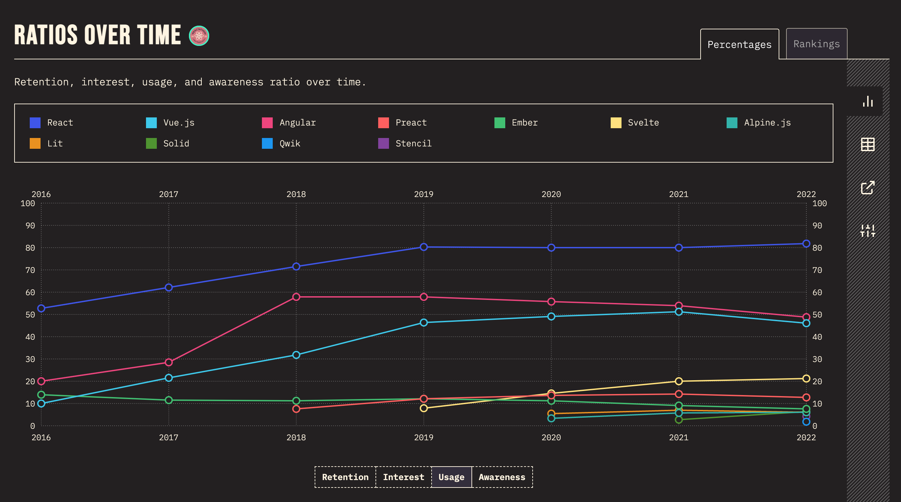
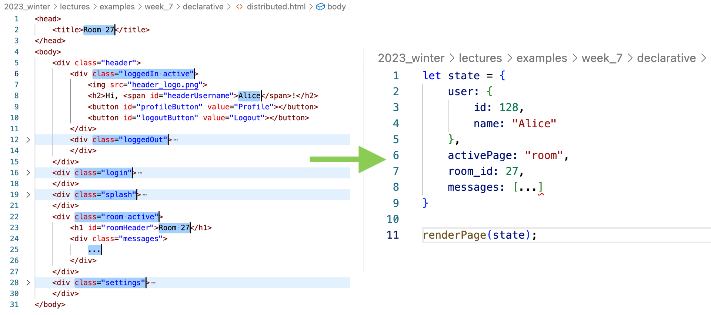

class: center, middle

# MPCS 52553: Web Development

## Week 7: Intro to React

---

class: agenda

# Final Project: Belay

# Intro to React

- Components
- JSX
- Props
- State

---

# Belay: a Slack clone

For the final project, we'll put together the concepts we've learned this
quarter into a single web application.

- Multi-column and responsive layouts
- Storing and retrieving records from a database
- APIs and asynchronous requests
- Single-page applications

The final project is worth 4 times as much as a regular Exercise and 40% of your
grade overall. You have the remainder of the quarter (i.e. through Friday
May 26) to complete it.

---

# Introduction to React

You will have noticed in working on Exercise 6 that it can be tedious and
difficult when writing a single-page application to manage what **state** the
app is supposed to be in what elements should be displayed to the user. You have
to change the navigation bar, update variables, and show/hide page elements all
manually, and trigger updates after each API callback.

[React](https://reactjs.org/) is a framework for developing interactive web
pages, and especially single-page applications, developed and released as open
source by Facebook. The powerful thing about it (and competing frameworks like
[Vue](https://vuejs.org/) and [Svelte](https://svelte.dev/)) is it lets you
define how the page should look in various states, and when you update the
state, the framework updates the page automatically for you.

That's less work for you as a developer, and fewer opportunities to make
mistakes.

---

# React and Exercise 6

If you have not yet completed Exercise 6, you may use any of the techniques we
use this week while working on it.

---

# Why React?

As with our discussion of Python in week 5, there are lots of alternatives, and
you can do great work in all of them. Try not to get emotionally invested in a
particular stack.

---

# Why React?

It's the most widely-used front-end framework, and well-liked by those who have
used it. Stats from
[State of JS](https://2022.stateofjs.com/en-US/libraries/front-end-frameworks/):

## 

---

# Why React?

More importantly for our purposes, React was the first to popularize ideas that
have become the standard adopted by other frameworks: **one-way binding** and
**declarative UI**.

---

# One-Way Binding & Declarative UI

Under the hood, React is doing something like:

    const renderPage = (props) => {
      document.queryElement("title").innerText = props.title;

      let container = document.createElement("div");
      container.classList.add("container")

      if(props.activePage == "login") {
        let container = document.createElement("div");
        container.classList.add("login");
        let loginPanel = document.createElement("div");
        ...
      }
      else if(props.activePage == "splash") {
        ...
      }
    }

---

# One-Way Binding & Declarative UI

https://beta.reactjs.org/learn/reacting-to-input-with-state

---

# Lab: React Tic Tac Toe

While React is useful and popular, for a long time the docs were OK at best. The
best introduction is the [tutorial](https://reactjs.org/tutorial/tutorial.html),
but even then it has a lot of moving parts. For reasons we'll get into, React
relies on pre-processing the code you write, which requires running
[Node](https://nodejs.org/en/), a separate framework that's for running for
server-side Javascript code.

Instead of all that, I've followed the instructions in their low-overhead guide
to
[add React to a website](https://reactjs.org/docs/add-react-to-a-website.html)
to make a starter project in `examples/week_7`. We'll start there and work
through the tutorial with it.

We'll be building a simple Tic Tac Toe game like this one:
https://codepen.io/gaearon/pen/gWWZgR?editors=0010

---

# Lab: React Tic Tac Toe

We'll need a local server to host our React application. Navigate to the
`examples/week_7/tictactoe` directory and run:

`python3 -m http.server`

That will let you see your Tic Tac Toe application at `http://localhost:8000`

From here we'll be working through the instructions on the tutorial in the React
documentation: https://reactjs.org/tutorial/tutorial.html

---

# Lab: React Tic Tac Toe

### Components

- OOP classes that can be re-used
- Takes in parameters called `props`
- Describes what to display in its `render` method

### JSX

- DSL
- Shorthand for `React.createElement(...`
- Evaluates Javascript inside curly braces `{}`
- Can include custom React components in addition to base HTML types

---

# Lab: React Tic Tac Toe

### Props

- Calls a component's `render` method any time they change
- Read-only to support one-directional data flow:
  https://medium.com/@lizdenhup/understanding-unidirectional-data-flow-in-react-3e3524c09d8e
- Can add type checking with
  [prop-types](https://www.npmjs.com/package/prop-types)

### State

- Update with `this.setState()`
- When you call setState in a component, React automatically updates the child
  components inside of it too.
- To let child components modify state, pass a handler function down to them as
  one of their `props`.
